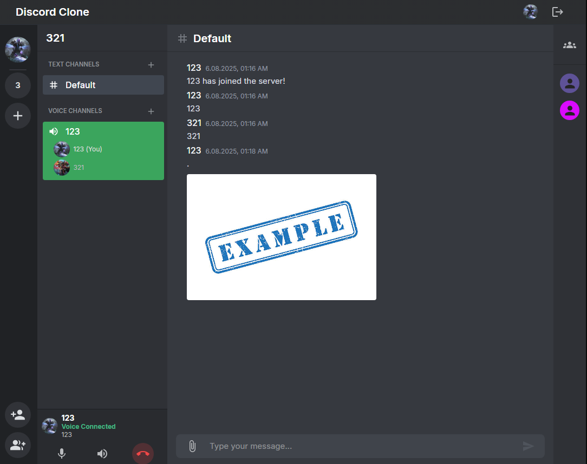
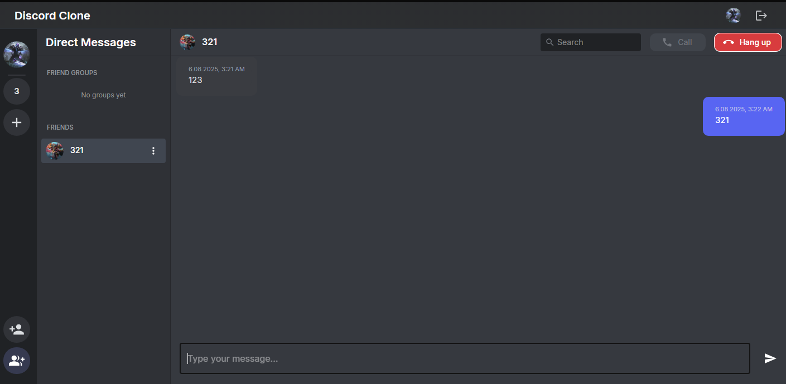

# DiscordClone

## Opis projektu  
DiscordClone to aplikacja do komunikacji tekstowej i głosowej, wzorowana na popularnej platformie Discord. Umożliwia użytkownikom prowadzenie rozmów prywatnych oraz na kanałach, a także zarządzanie grupami i ich rozmowami.  

### Główne funkcjonalności:
- Rozmowy tekstowe i głosowe – prywatne oraz na kanałach  
- Rozmowy tekstowe w grupach oraz zarządzanie grupami  
- Wysyłanie załączników na serwerach (funkcjonalność w trakcie rozwoju)  
- Kilka dodatkowych funkcjonalności wspierających komunikację  

## Zrzuty ekranu

### Widok serwera  


### Prywatny czat  


---

## Technologie

### Backend  
- **.NET 6+**  
- **C#**  
- **ASP.NET Core**  
- **Entity Framework Core**  
- **Microsoft SQL Server LocalDB** (lokalna baza danych do rozwoju)  
- **SignalR** – do komunikacji w czasie rzeczywistym  
- JWT – uwierzytelnianie i autoryzacja  

### Frontend  
- **React 18** (z TypeScript)  
- **MobX** – zarządzanie stanem aplikacji  
- **Material-UI (MUI)** – biblioteka komponentów UI  
- **React Router Dom** – routowanie  
- **Axios** – komunikacja HTTP  
- **Vite** – narzędzie do budowania i developmentu  


## Uruchomienie projektu

Po sklonowaniu repozytorium:

1. Wykonaj migracje, aby utworzyć bazę danych:

```bash
dotnet restore
dotnet ef database update
```

Uruchom backend:

```bash
dotnet run
```
W osobnym terminalu uruchom frontend:

```bash
cd client-app
npm install
npm run dev
```

Aplikacja będzie dostępna pod adresem `http://localhost:3000`
Backend działa na adresie `http://localhost:5000`
